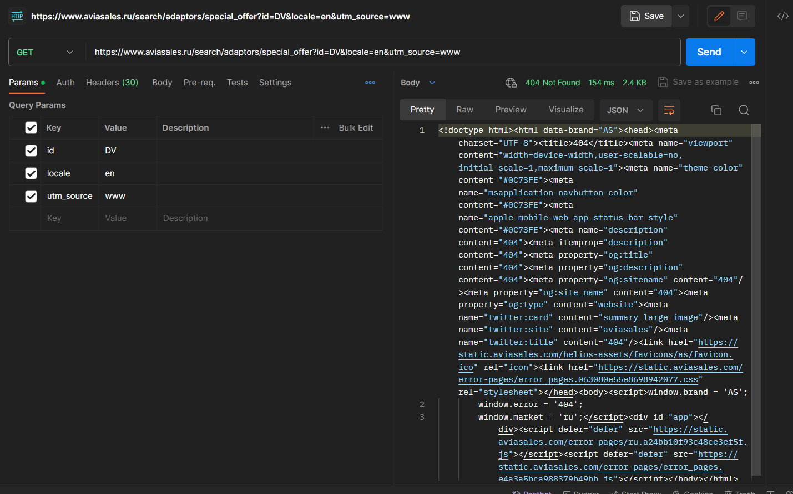
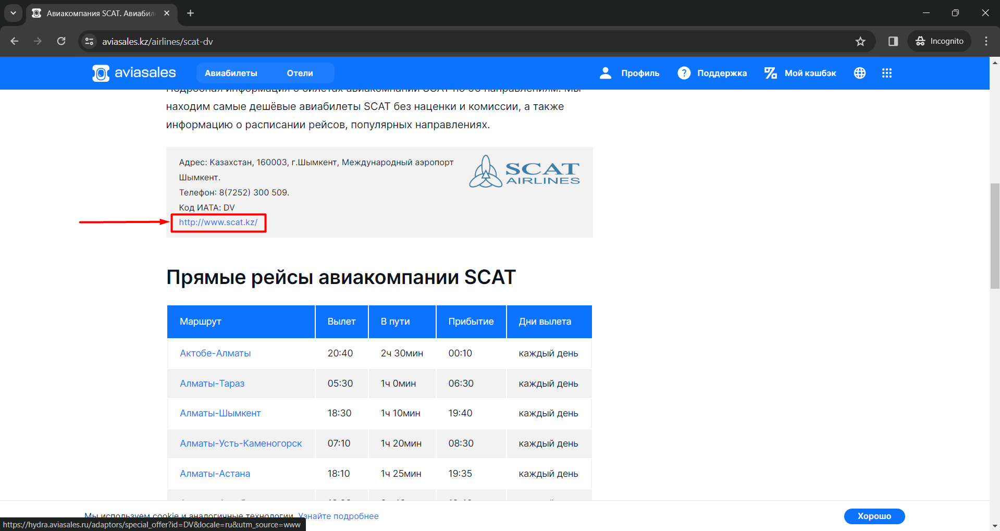
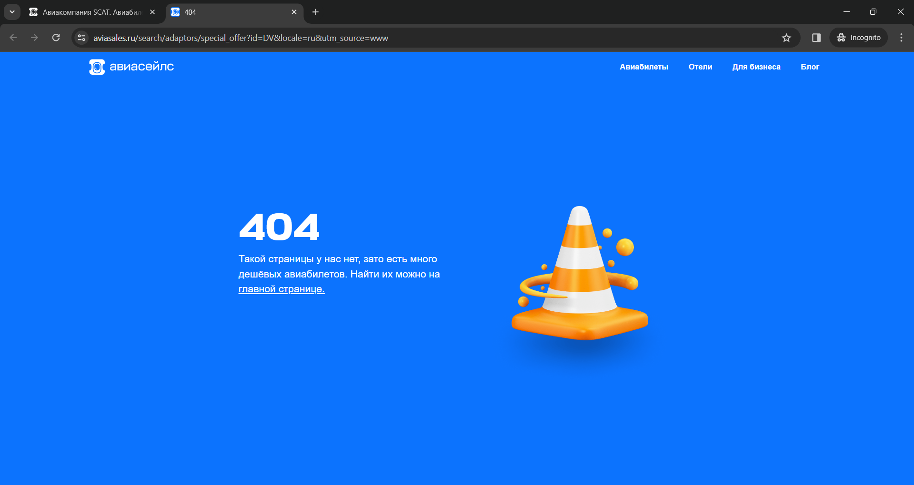

# 🐞 Эндпоинт ../search/adaptors/special_offer не работает

| Status | Closed |
| --- | --- |
| Priority | Low |
| Assigned to | A Developer |
| Date | 22.02.2024 |
| Type | API |

**Description:**

Ручка возвращает 404 в результате чего,  нельзя перейти по ссылке партнёрских авиалиний в UI

**Steps to reproduce:**

1. Отправить HTTP-запрос (curl во вложениях) с помощью любого инструмента
2. Проверить код ответа

**Expected results:**

301 Moved permanently

**Actual results:**

404 Not Found

**Environment:**

auid: "cWUzR2XXXpJXcEhHN0U3Ag=="
os: "windows 10"
browser: "Chrome 121.0.0.0"

**Attachments:**

```bash
curl 'https://www.aviasales.ru/search/adaptors/special_offer?id=SU&locale=ru&utm_source=www' \
  -H 'authority: www.aviasales.ru' \
  -H 'accept: text/html,application/xhtml+xml,application/xml;q=0.9,image/avif,image/webp,image/apng,*/*;q=0.8,application/signed-exchange;v=b3;q=0.7' \
  -H 'accept-language: ru' \
  -H 'cache-control: max-age=0' \
  -H 'cookie: auid=cWUzR2XXXpJXcEhHN0U3Ag==; currency=RUB; marker=direct; nuid=51f8cc3b-47f8-48b9-a54d-0afb28c333b7; _gcl_au=1.1.1609007387.1708613272; _ym_uid=1708613273963673900; _ym_d=1708613273; _gid=GA1.2.1672893052.1708613274; tmr_lvid=aeb3315f710eb98e7627e8012877c020; tmr_lvidTS=1708613273644; _ym_isad=2; uxs_uid=5c7dde80-d191-11ee-a740-aff4a90018b9; currency=rub; _sp_ses.dc27=*; _awt=37a37392344226936961d3ff182808306473160359333430f335123c38363831449-ed883d3634ef3; _sp_id.dc27=151996e8-1956-4754-b9ec-2f6e41d3d6ba.1708613271.3.1708631122.1708623889.e4716856-32eb-4584-a6b9-7ec487054a8f.2b8e1f08-87bc-48bf-a195-e26870b49bb9.98ae65bf-cf2f-40c2-aee0-6c70089260da.1708631120267.7; _ga_EVCZWTNN22=GS1.1.1708631122.4.0.1708631122.0.0.0; _ga_GCLPS5EN9Q=GS1.1.1708631122.4.0.1708631122.60.0.0; _ga=GA1.2.2076650011.1708613273; _ga_12NR00W4QQ=GS1.1.1708631122.4.0.1708631122.60.0.0; _ym_visorc=b; FCNEC=%5B%5B%22AKsRol-mh7FjhZlJmbLoMbQkWBcvfN5S8c6m-OthWU94-mIaP6TCoC8NB5wkAXCUh05pLERKz_5IWlKZNqzwakZ8gzOLX2wDvuxG49IxUFaMYZNKo-iN7Zxv8AG2p8AWLIh8YTvy3dnYWOwT8I0N36KboDsqFDwLgA%3D%3D%22%5D%5D; tmr_detect=0%7C1708631125091; cto_bundle=SBrij193aVhCaUVGTEpjVGZEODljRzN1SGhUU3VORGV5Qm9Ub1ZBUkhZaSUyRk1mVGlheUFmejhOTERtazQ3ZUF3VXU5andtYWt2R0N0WVl1aGdRMCUyRiUyRlVrajlteXRuOXE3SDdCb2NRYWdaN256MEVqRzhtb2tLREp5SG5XQXJEZk5MY09pNWtqeDRUVjYwOWpodUd0dGFCSWM4OHBDTW9iSEF0MmpyVUNuamxkemphUFklM0Q; _ga_KD6Y7CZ85S=GS1.2.1708631123.3.1.1708631137.46.0.0' \
  -H 'referer: https://www.aviasales.ru/' \
  -H 'sec-ch-ua: "Not A(Brand";v="99", "Google Chrome";v="121", "Chromium";v="121"' \
  -H 'sec-ch-ua-arch: "x86"' \
  -H 'sec-ch-ua-bitness: "64"' \
  -H 'sec-ch-ua-full-version: "121.0.6167.185"' \
  -H 'sec-ch-ua-full-version-list: "Not A(Brand";v="99.0.0.0", "Google Chrome";v="121.0.6167.185", "Chromium";v="121.0.6167.185"' \
  -H 'sec-ch-ua-mobile: ?0' \
  -H 'sec-ch-ua-model: ""' \
  -H 'sec-ch-ua-platform: "Windows"' \
  -H 'sec-ch-ua-platform-version: "15.0.0"' \
  -H 'sec-ch-ua-wow64: ?0' \
  -H 'sec-fetch-dest: document' \
  -H 'sec-fetch-mode: navigate' \
  -H 'sec-fetch-site: same-origin' \
  -H 'sec-fetch-user: ?1' \
  -H 'upgrade-insecure-requests: 1' \
  -H 'user-agent: Mozilla/5.0 (Windows NT 10.0; Win64; x64) AppleWebKit/537.36 (KHTML, like Gecko) Chrome/121.0.0.0 Safari/537.36' \
  --compressed
```





